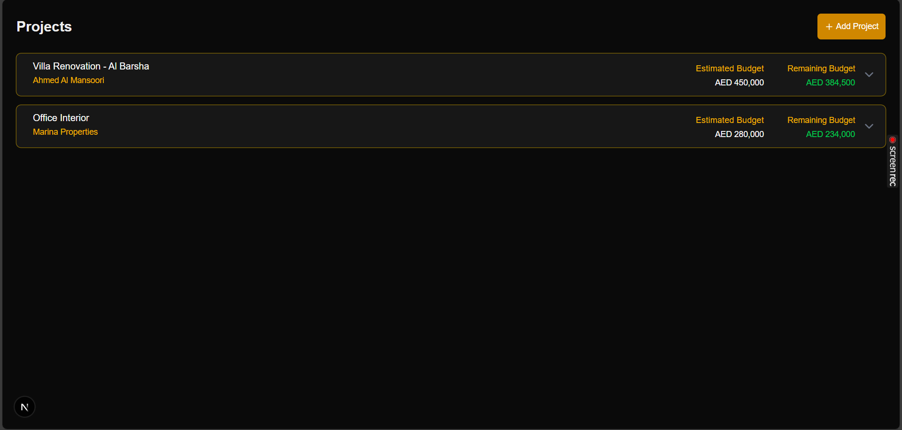
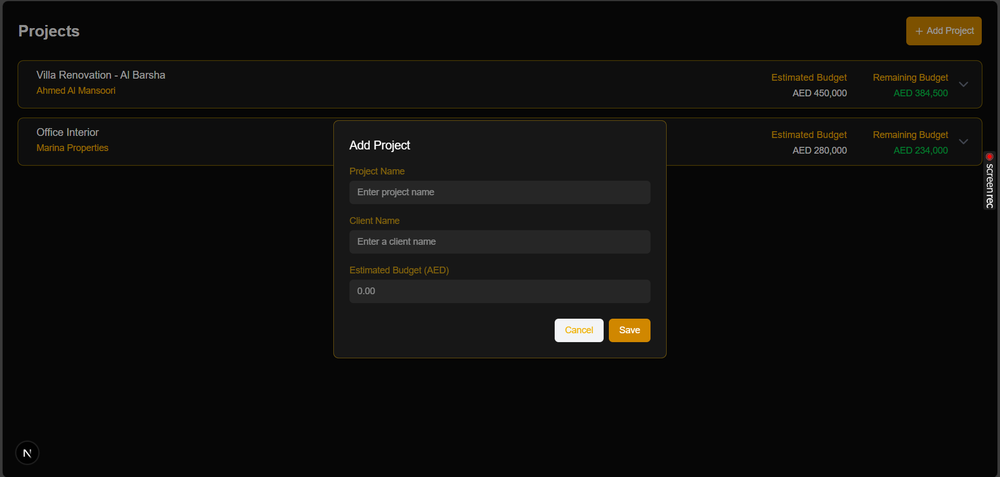
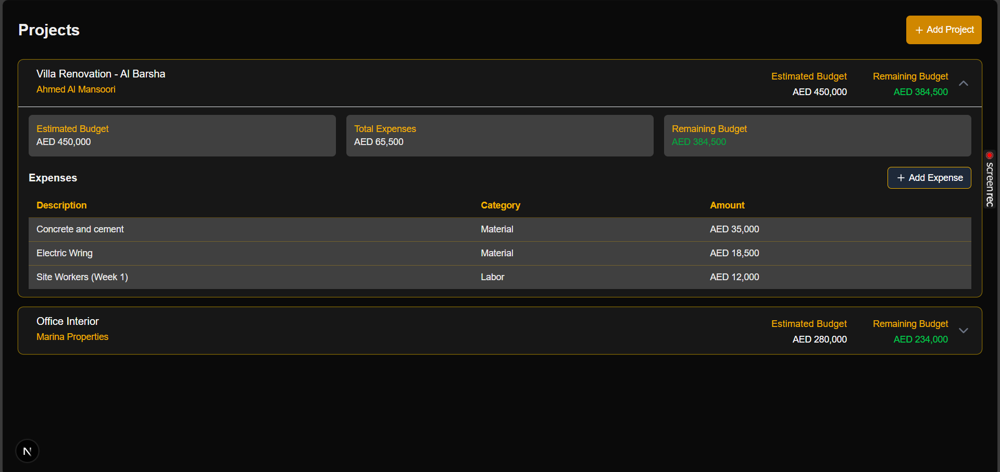
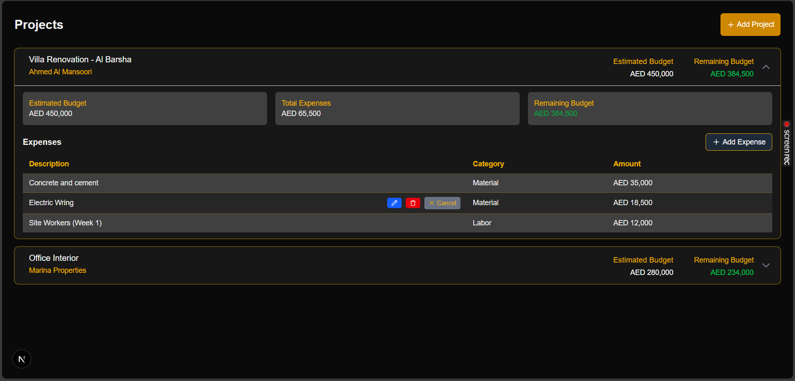

# Project Expense Tracker 🚀

Fullstack web application to manage project budgets and track expenses. Built with **Next.js 14**, **Node.js/Express**, **PostgreSQL**, and **Tailwind CSS**.

Project Listing Page

## ✨ Features

- ✅ **Project Management**: Create, view, expand projects
- ✅ **Budget Tracking**: Real-time remaining budget calculation
- ✅ **Expense Management**: Add, edit, delete expenses per project
- ✅ **Responsive Design**: Works on desktop + mobile
- ✅ **Automatic calculations**: Total expenses, remaining budget

## 🛠️ Tech Stack
| Layer | Technology |
|-------|------------|
| **Frontend** | Next.js 14, React 18, Tailwind CSS |
| **Backend** | Node.js, Express.js |
| **Database** | PostgreSQL |

## 📋 Prerequisites

Before you begin, ensure you have the following installed:

- **Node.js** (v18 or higher) - [Download](https://nodejs.org/)
- **PostgreSQL** (v14 or higher) - [Download](https://www.postgresql.org/download/)

2. Database Setup
Start PostgreSQL and create the database:

## Create database
CREATE DATABASE project_expense_db;

## Database Schema

#### Create projects table
CREATE TABLE projects (
  id SERIAL PRIMARY KEY,
  name VARCHAR(255) NOT NULL,
  client_name VARCHAR(255) NOT NULL,
  estimated_budget NUMERIC(12,2) NOT NULL CHECK (estimated_budget >= 0),
  created_at TIMESTAMP DEFAULT CURRENT_TIMESTAMP
);
#### Create expense table**
CREATE TABLE expenses (
  id SERIAL PRIMARY KEY,
  project_id INTEGER NOT NULL REFERENCES projects(id) ON DELETE CASCADE,
  description TEXT NOT NULL,
  amount NUMERIC(12,2) NOT NULL CHECK (amount >= 0),
  category VARCHAR(50) NOT NULL CHECK (category IN ('material','labor','other')),
  created_at TIMESTAMP DEFAULT CURRENT_TIMESTAMP
);

#### API Endpoints

GET    /api/projects           # List all projects + budget summary
POST   /api/projects           # Create project
GET    /api/projects/:id       # Single project + expenses
POST   /api/expenses/:projectId # Add expense
PUT    /api/expenses/:id       # Update expense
DELETE /api/expenses/:id       # Delete expense

## 3. Environment Variables
**backend/.env**

PORT=4000

DB_HOST=localhost
DB_PORT=5432
DB_USER=postgres
DB_PASSWORD=postgres
DB_NAME=project_expense_db

## 4. Run Application
bash
### Terminal 1: Backend
cd backend
node server.js # http://localhost:4000  

#### Terminal 2: Frontend
cd frontend
npm install lucide-react
npm run dev # http://localhost:3000

## 📸 Screenshots
Project Listing Page

Main page showing all projects with budget information

Add Project Modal

Modal for creating a new project

Expanded Project Section

Showing project details and expense list

Add Expense Form

Form for adding new expense details

Delete/Edit Expense Form

Edit/Delete action on expense details

## ⚙️ Assumptions Made
- **Local Development**: PostgreSQL running locally on port 5432

- **AED Currency**: UAE-based (Dubai location)

- **No Authentication**: Admin-only access assumed

- **Single User** - all users see the same projects and expenses

- **Categories**: Expense categories are limited to three types:

Material
Labor
Other

## Future Improvements
 - **User Authentication**: Add login/signup with JWT tokens
 - **Project Edit**: Allow editing project details after creation
 - **Project Status**: Add status field (Active, Completed, On Hold)
 - **Expense Attachments**: Upload receipts/invoices for expenses
 - **Export Data**: Export projects and expenses to PDF/Excel
 - **Search & Filter**: Search projects by name, filter by date range
 - **Dashboard**: Add charts and analytics for budget visualization
 